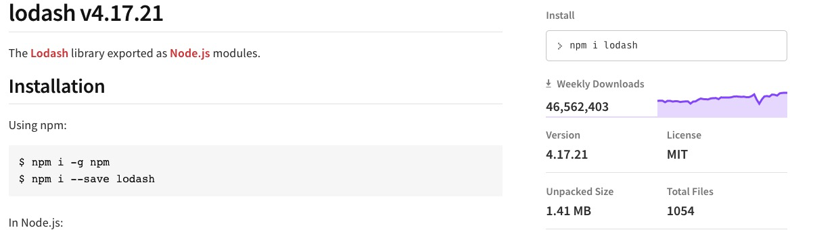
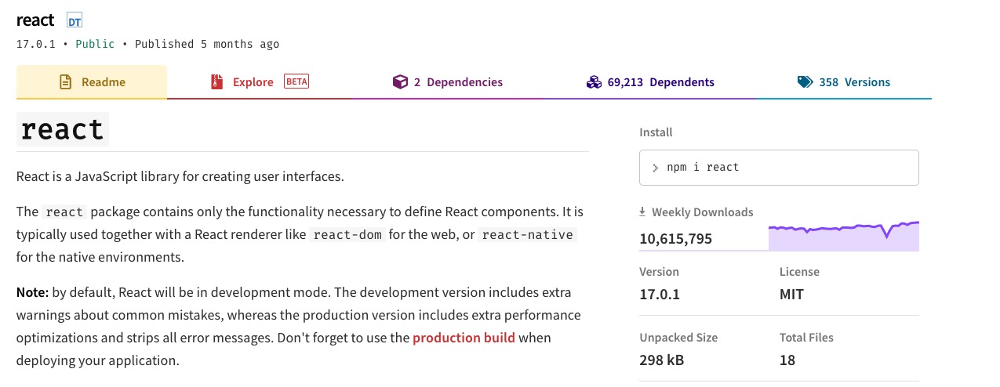
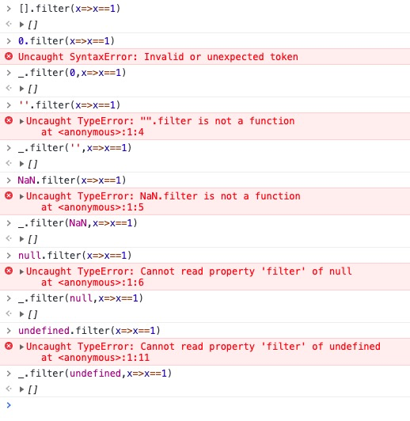

LODASH

1. 什么是lodash  
    * Lodash 是一个一致性、模块化、高性能的 JavaScript 实用工具库

1. 为什么用lodash
    1. 健壮性
        1. 完善的测试用例覆盖（npm下载量 lodash---react）
            * 
            * 
        1. 完善的防空处理 
            * 
    1. 可读性
        1. [语义化](https://www.lodashjs.com)
            * [omit](./omit.js)
    1. 开发效率
        1. 提供了大量的工具函数，减少编码时间
        1. 协作性
        1. 良好的ts提示

1. lodash常用方法介绍
    1. [对象合并](./merge.js)
    1. [深拷贝](./cloneDeep.js)
    1. [包含](./includes.js)
    1. [单次执行函数](./once.js)

once

isEqual

throttle

includes

reject

pick

omit

cloneDeep  
